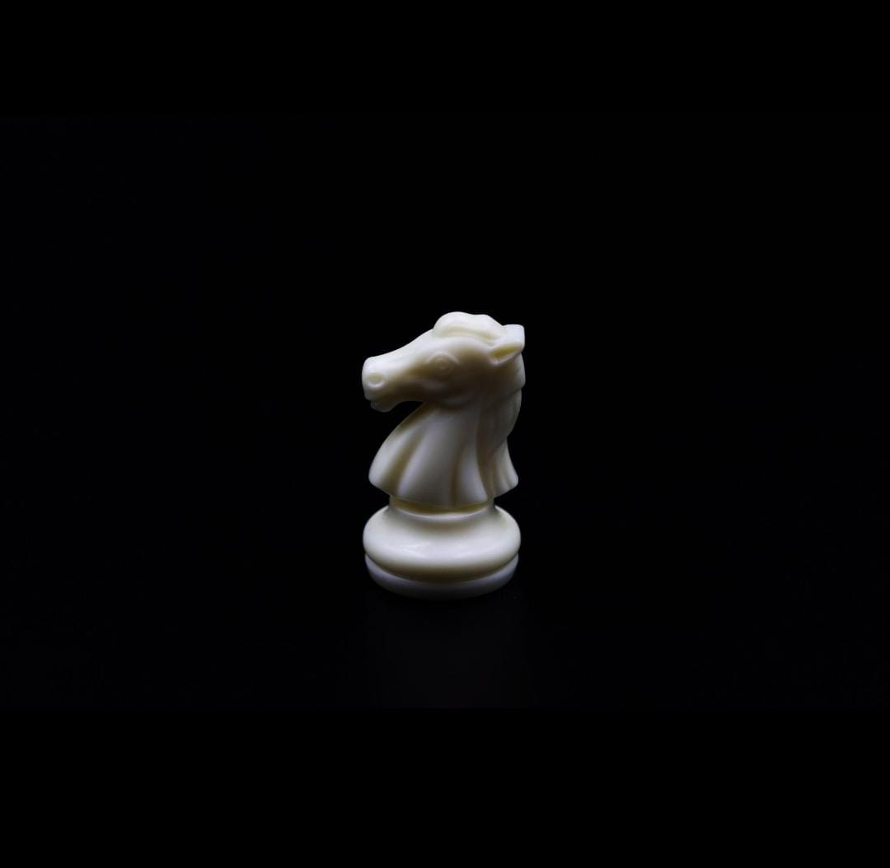
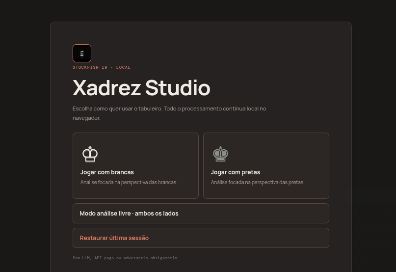
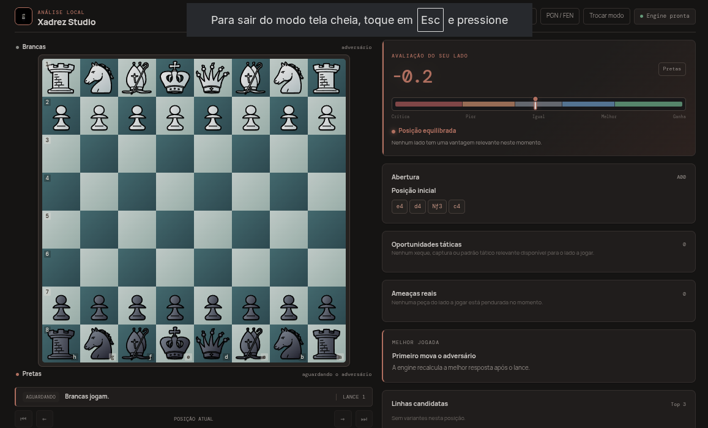
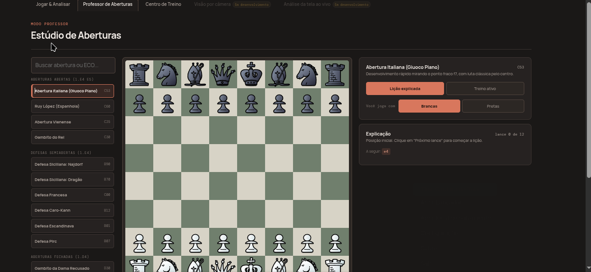
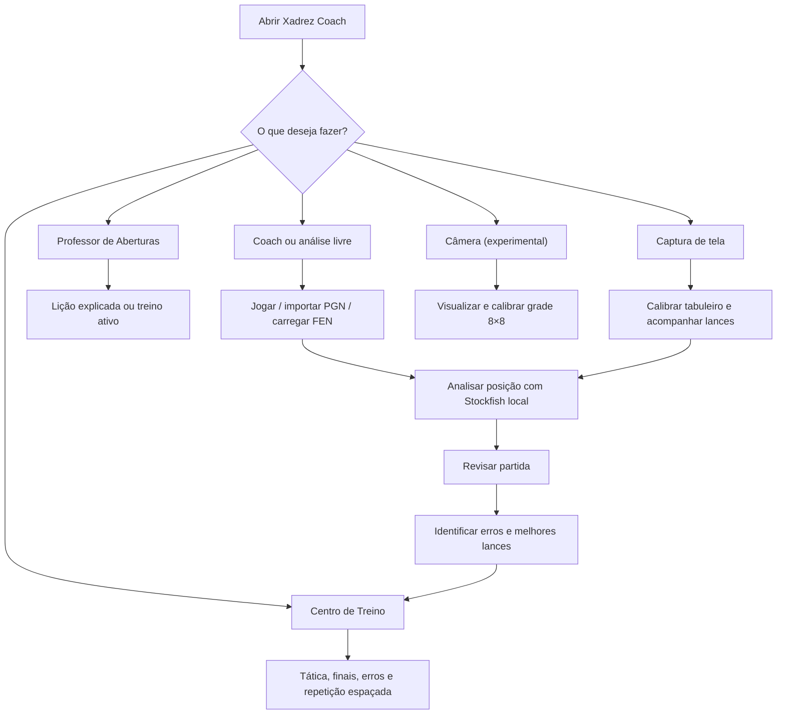
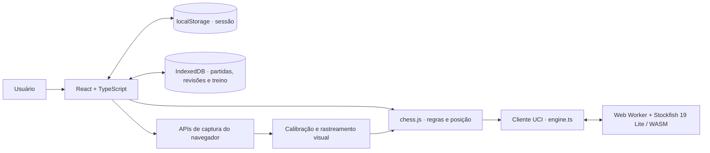
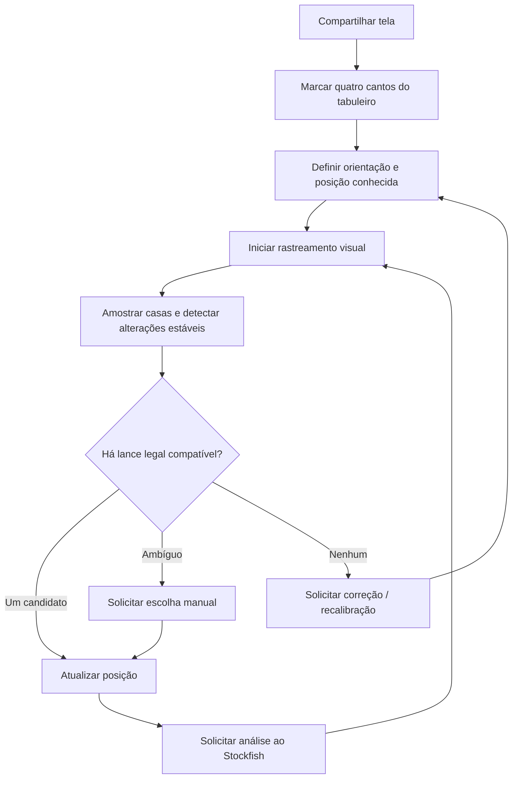

<div align="center">



# Xadrez Studio

**Estude aberturas, analise partidas e evolua no xadrez com o Stockfish 19 executado localmente.**

</div>

Aplicação web para estudar xadrez, analisar partidas e praticar posições com o **Stockfish 19 Lite executado localmente no navegador**. O tabuleiro permite reproduzir manualmente os lances de uma partida, examinar variantes e revisar decisões sem depender de uma API paga ou de um backend de análise.

> **Estado das funcionalidades:** a análise do tabuleiro, os treinos e a captura de tela têm fluxos distintos. A captura **por câmera** oferece visualização e calibração do tabuleiro, mas **ainda não reconhece automaticamente peças ou lances**. A captura **de tela** acompanha mudanças visuais em um tabuleiro previamente calibrado e pode exigir confirmação manual de lances ambíguos; não faz reconhecimento geral de peças por IA.

## Imagens do projeto

As capturas abaixo apresentam a interface atual do Xadrez Studio.

### Tela inicial



### Jogar e analisar



### Professor de Aberturas



## O que é o Stockfish?

O **Stockfish** é um motor de xadrez (*chess engine*) livre e de código aberto que calcula e avalia posições para encontrar lances fortes. Diferentemente de um aplicativo para jogar xadrez, ele não fornece por si só uma interface de tabuleiro: recebe uma posição, examina sequências possíveis de lances e devolve resultados que outros programas podem apresentar ao jogador.

Neste projeto, o **Stockfish 19 Lite** é o motor responsável pelas recomendações e avaliações. O aplicativo envia a posição atual em **FEN** (uma notação textual que descreve o estado do tabuleiro) ao motor usando o protocolo **UCI**, e recebe análises que a interface apresenta em forma de melhores lances, variantes, avaliação e alertas de mate. O motor executa no próprio navegador usando **WebAssembly** e um **Web Worker**, sem exigir uma API paga ou enviar posições a um servidor de análise.

- **Melhor lance:** movimento sugerido pelo motor para a posição analisada; não representa garantia de vitória.
- **Avaliação:** estimativa da vantagem de um dos lados, geralmente expressa em centipawns (100 centipawns = um peão de referência) ou em número de lances até um mate calculado. É uma medida do motor, não uma pontuação absoluta da partida.
- **Profundidade:** quantidade de camadas de lances exploradas na busca; valores maiores normalmente exigem mais processamento e tempo.
- **MultiPV:** número de variantes principais apresentadas simultaneamente, permitindo comparar alternativas em vez de mostrar apenas um lance.

O Stockfish é um **motor de busca e avaliação de posições**, não um modelo de linguagem: as explicações em texto desta aplicação são heurísticas produzidas pela própria interface. Para conhecer o motor e seu código-fonte, consulte [stockfishchess.org](https://stockfishchess.org/) e o [repositório oficial do Stockfish](https://github.com/official-stockfish/Stockfish). Sua distribuição é regida pela GPL-3.0; veja a seção de licenças abaixo.

## Funcionalidades

| Área | O que oferece |
| --- | --- |
| **Coach** | Escolha de brancas ou pretas, recomendações para o lado escolhido, seta do melhor lance, avaliação, variantes MultiPV, profundidade configurável e explicações heurísticas. Os dois lados são movimentados manualmente. |
| **Análise livre** | Análise contínua dos dois lados, navegação no histórico, importação/exportação de PGN e carregamento/cópia de FEN. |
| **Revisão pós-partida** | Classificação de lances, perda estimada em centipawns, precisão estimada, gráfico de avaliação, comparação com o melhor lance e treino dos erros identificados. |
| **Professor de Aberturas** | Cursos com explicações lance a lance e modo de treino ativo, com verificação de desvios da linha estudada. |
| **Centro de Treino** | Exercícios de tática e finais, puzzles gerados a partir de erros em partidas revisadas e repetição espaçada do progresso. |
| **Análise da tela ao vivo** | Compartilhamento de tela, calibração de quatro cantos, identificação de mudanças nas casas e correspondência com lances legais, com resolução manual quando necessário. |
| **Tabuleiro por câmera — experimental** | Acesso à câmera, seleção do dispositivo, orientação e calibração visual de uma grade 8×8; reconhecimento automático ainda não implementado. |

O tabuleiro principal também oferece movimento por clique ou arrastar/soltar, indicação de movimentos legais, promoção, destaque de xeque, detecção de fim de partida e personalização de peças e cores. A aplicação é responsiva para desktop e dispositivos móveis.


## Visão geral dos fluxos

Os diagramas abaixo são renderizados diretamente pelo GitHub e mostram os caminhos disponíveis na aplicação.

### Jornada de estudo



### Arquitetura de execução local



A captura por câmera **não** produz automaticamente uma posição FEN: o reconhecimento de peças ainda não está implementado nessa área. O diagrama representa somente a integração das capturas que já alimentam uma posição conhecida do jogo. O motor, os dados da sessão e as revisões não precisam de uma API de análise remota.

### Fluxo da análise de tela



> O rastreamento depende da qualidade da imagem, de uma posição inicial correta e de um tabuleiro calibrado. Não se trata de reconhecimento universal de peças nem de uma integração com plataformas externas de xadrez.

## Tecnologias e funcionamento

- **Interface:** React 19, TypeScript e Vite 7.
- **Regras e notação:** `chess.js`.
- **Motor:** Stockfish 19 Lite, via Web Worker/WebAssembly e protocolo UCI.
- **Persistência:** sessão local no `localStorage`; histórico, revisões e progresso de treino no `IndexedDB` do navegador.
- **Captura e visão:** APIs de câmera/compartilhamento de tela do navegador e comparação de alterações visuais nas casas do tabuleiro. O pacote `onnxruntime-web` está presente nas dependências, mas isso **não significa que o reconhecimento por câmera esteja pronto**.

A análise do motor é local. Não é necessário cadastrar uma chave de API para as funções descritas acima. A performance depende do navegador e do equipamento; a captura de tela requer permissão explícita e pode variar conforme o conteúdo compartilhado.

## Pré-requisitos

- Node.js e npm instalados.
- Navegador moderno com suporte a WebAssembly e Web Workers.
- Para captura de câmera ou tela: navegador compatível, permissão de acesso e execução em `localhost` ou HTTPS.
- Para os scripts `start.sh` e `stop.sh`: ambiente Linux com Bash.

## Instalação e execução

Clone o repositório e entre na pasta:

```bash
git clone https://github.com/r0bertgabriel/xadrez-dev.git
cd xadrez-dev
npm ci
npm run dev
```

Abra o endereço informado pelo Vite no terminal (normalmente `http://localhost:5173`). O `postinstall` e o comando `dev` preparam os arquivos locais do Stockfish automaticamente.

### Execução em segundo plano no Linux

```bash
./start.sh
# Acesse http://localhost:5173
./stop.sh
```

O `start.sh` instala dependências caso necessário, prepara o motor, inicia o Vite, registra o processo em `.xadrez-dev.pid` e escreve o log em `.xadrez-dev.log`. Para usar outra porta:

```bash
PORT=5174 ./start.sh
```

Para acompanhar o log:

```bash
tail -f .xadrez-dev.log
```

**Atenção:** o script inicia o Vite com `--host 0.0.0.0`, disponibilizando o servidor de desenvolvimento nas interfaces de rede do computador. Use-o apenas em uma rede confiável; não é uma configuração de produção.

## Como usar

1. Abra a área principal e escolha **Coach** (brancas ou pretas) ou **Análise livre**.
2. Movimente as peças dos dois lados para reproduzir a partida. Ajuste profundidade e quantidade de variantes conforme a capacidade do dispositivo.
3. Importe um PGN ou carregue uma FEN para estudar outra posição; ao terminar, use a revisão pós-partida para examinar os lances.
4. Acesse **Professor de Aberturas** para estudar linhas explicadas ou praticá-las; use **Centro de Treino** para trabalhar tática, finais e erros identificados nas revisões.
5. Na **Análise da tela ao vivo**, conceda a permissão de compartilhamento, marque os quatro cantos do tabuleiro na ordem indicada, defina a orientação e acompanhe o status do rastreamento. Confirme manualmente lances que não possam ser determinados com segurança.
6. No **Tabuleiro por câmera**, conceda acesso e calibre a grade. Essa área ainda não converte a imagem em uma posição de xadrez automaticamente.

**Limitação importante:** o rastreamento da tela compara mudanças de luminosidade nas casas e as relaciona com os lances legais da posição conhecida. Animações, destaques, mudança de tema, orientação incorreta, baixa qualidade de captura e perda de sincronização podem exigir nova calibração ou correção manual.

## Comandos úteis

| Comando | Finalidade |
| --- | --- |
| `npm run dev` | Prepara o Stockfish e inicia o servidor de desenvolvimento. |
| `npm test` | Executa os testes de regras de xadrez e dados de treino. |
| `npm run build` | Prepara o motor, verifica TypeScript e gera `dist/`. |
| `npm run preview` | Pré-visualiza localmente o build gerado. |
| `npm run check` | Executa testes e build em sequência. |
| `npm run prepare:engine` | Copia/prepara os arquivos do Stockfish utilizados pela interface. |

## Organização do código

```text
src/
  App.tsx                # Tabuleiro principal, Coach, análise e revisão
  OpeningTrainer.tsx     # Aberturas e treino ativo
  TrainingHub.tsx        # Exercícios e progresso
  ScreenAnalysis.tsx     # Compartilhamento e rastreamento da tela
  CameraAnalysis.tsx     # Captura/calibração por câmera (experimental)
  engine.ts              # Integração com Stockfish
  hooks/                 # Estado do jogo, motor e captura
  vision/                # Geometria e acompanhamento visual do tabuleiro
  persistence.ts         # Dados locais de partidas/revisões/treino
  training-data.ts       # Posições de treino
scripts/                 # Preparação do motor e testes
public/pieces/           # Conjuntos de peças
openspec/                # Especificações e propostas de mudanças
```

## Testes e diagnóstico

```bash
npm run check
```

Os testes automatizados cobrem regras críticas de xadrez e dados de treino. O comando acima também verifica o build, mas **não substitui testes manuais de interface, permissões de captura e comportamento do motor em diferentes navegadores**.

Se a análise não iniciar, consulte o console do navegador e, ao usar `start.sh`, o arquivo `.xadrez-dev.log`. Confira se os arquivos do motor foram preparados com `npm run prepare:engine`. Para problemas de captura, verifique permissões, origem segura (`localhost`/HTTPS) e a calibração do tabuleiro.

## Licença livre e componentes de terceiros

O **código e a documentação autorais** deste projeto são disponibilizados sob a [licença MIT](LICENSE): é permitido usar, estudar, modificar e redistribuir esse material, inclusive comercialmente, preservando o aviso de direitos autorais e a licença. A licença MIT **não altera** os direitos sobre arquivos de terceiros presentes no repositório ou instalados como dependências.

- **Stockfish / Stockfish.js:** motor distribuído sob GPL-3.0. Ao redistribuir um produto que inclua o motor, é necessário avaliar e cumprir as exigências da GPL, incluindo a disponibilização do código-fonte correspondente e a licença aplicável ao conjunto distribuído. A licença MIT do código autoral não dispensa essas obrigações.
- **Conjuntos de peças:** artes com licenças próprias, incluindo condições de atribuição e compartilhamento pela mesma licença em alguns conjuntos; consulte [`public/pieces/ATTRIBUTION.md`](public/pieces/ATTRIBUTION.md) e a origem de cada asset antes de redistribuí-lo.
- **Outras dependências e modelos/datasets:** permanecem sujeitos às licenças dos respectivos titulares; confira suas condições antes de redistribuir binários ou materiais derivados.

**Importante:** manter o repositório privado não o torna automaticamente público. A licença descreve as permissões concedidas a quem tiver acesso legítimo ao código.
